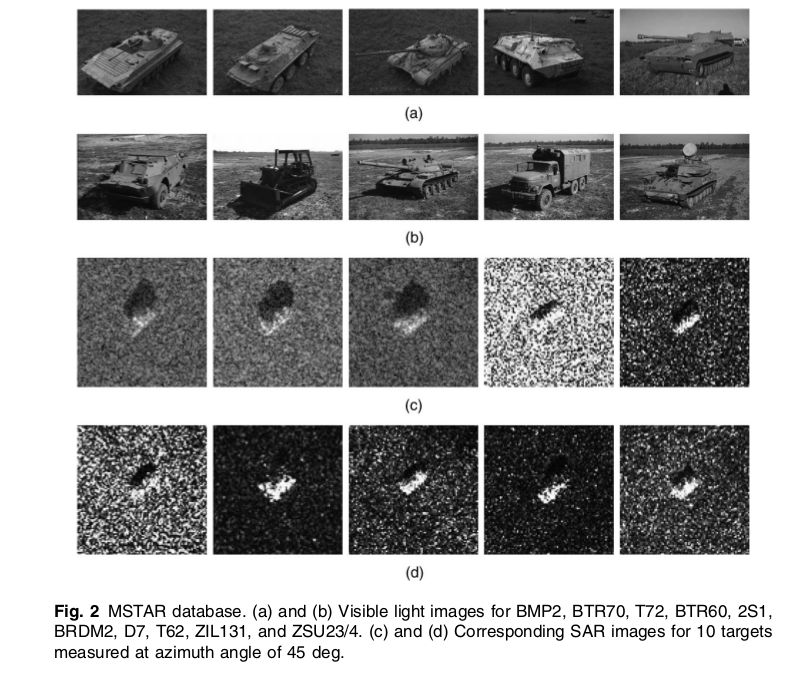

MSTAR Tensorflow

Synthetic Aperture Radar (SAR) object recognition is an important problem for automatic target recognition and aerial reconnaissance in military applications. We propose to use a deep convolutional neural network to classify and extract useful features of target chips taken from SAR image scenes. We will use the publically available Moving and Stationary Target Acquisition and Recognition (MSTAR) database as our dataset to evaluate our network.

# Introduction

We want to train a deep neural network to identify targets in the three class MSTAR dataset obtained from https://www.sdms.afrl.af.mil/index.php?collection=mstar&page=targets and possibly the ten class dataset from 
https://www.sdms.afrl.af.mil/index.php?collection=mstar&page=mixed.

Our base will be the paper *Deep convolutional neural networks for ATR from SAR imagery* [Morgan 2015], where they claim to achieve an overall 92.3% classification accuracy for the ten class problem.

We will explore a few number of different convolutional network configurations and also residual networks.

[//]: # (Also look at *APPLICATION OF DEEP LEARNING ALGORITHMS TO MSTAR DATA* [Wang, Chen, Xu, Jin 2015] where they claim 99.1% accuracy with All-ConvNets)

# Background

## SAR and MSTAR database

Synthetic Aperture Radar (SAR) is a form of radar that uses the motion of an antenna over a distance to create a large "synthetic" antenna aperture, so that it can provide much finer resolution images than standard radar.

The MSTAR dataset is a collection of SAR images gathered from 1995-1997. The two subsets we are interested in are the MSTAR Public Targets, that contains three classes of vehicles, and the MSTAR/IU Mixed Targets, that contains 10 classes of vehicles.

The images are target chips taken from scenes of SAR images, each chip is 128 by 128 pixels and contains magnitude data and phase data in the form of floating point numbers. For our purposes we only consider the magnitude data.

[//]: # (Automatic target classification of man-made objects in synthetic aperture radar images using Gabor wavelet and neural network Perumal Vasuki S. Mohamed Mansoor Roomi)

## Convolutional Networks

There are lots of tutorials on convolutional networks. Google them.

## Residual Networks

Residual networks are a recent evolution of convolutional networks that have allowed much deeper networks than conventional convolutional networks. For example, in the paper *Deep Residual Learning for Image Recognition* [He, Zhang, Ren, Sun 2015] they used an ensemble of 6 residual networks, each having up to 152 layers, to achieve a 3.57% top-5 error rate in ILSVRC 2015.

In a residual network, we have what are called residual blocks, a pair of layers where the input of the first layer is added to the output of the second layer. The mapping is similar to learning $F(x) = H(x) - x$, where $H(x)$ is the original function we wish to learn. The authors of the Deep Residual Learning paper hypothesize that it is easier for a network to learn this residual than to optimize the original function.

